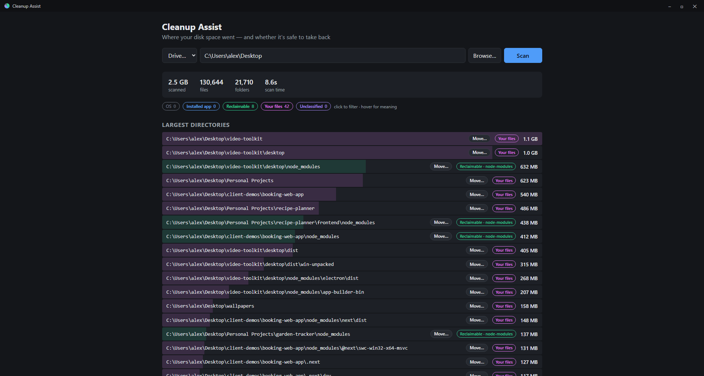

<div align="center">


# Cleanup Assist

**Find out where your disk space went — and whether it's safe to take back.**

*A Windows 11 disk analyzer that answers the question every other one leaves you with.*

<a href="https://github.com/RGaskinLtd/cleanup-assist/releases/latest"></a>



</div>

---

Every disk analyzer can tell you a folder is 30 GB. Then it abandons you, staring at
some cryptic path, wondering whether deleting it frees your drive or breaks your PC.
**That judgment call is the actual chore** — so this app makes it for you, or tells you
honestly when it can't.

## What you get

🏷️ **Every large folder gets a verdict, not just a size.** Scan a drive and each
result is badged: part of Windows, owned by an installed app (with the app's name),
a known-reclaimable cache, your personal files — or genuinely unknown, which now
actually means something.

🧠 **A 46-rule database of known space hogs** — `node_modules`, Docker/WSL virtual
disks, shader caches, `Windows.old`, npm/pip/cargo/gradle caches, crash dumps, even
forgotten iPhone backups — each with a tooltip explaining *how* to reclaim it safely.
Folders that dodge every rule but are literally named `cache` or `temp` get flagged too.

🚚 **Move folders to another drive without breaking anything.** One click copies a
folder to your other drive and leaves an NTFS junction behind, so every app keeps
working as if nothing moved. Live progress bar included — even mid-file on huge
virtual disks.

🛡️ **Paranoid by design.** Your data is never the only copy mid-move: the original
is kept until the copy and junction are verified, any failure rolls back, and locked
folders fail fast with advice instead of half-finished moves. OS folders can't be
moved or deleted at all — the app points you at Storage Sense and Disk Cleanup instead.

🔍 **Filter by badge, watch scans live, browse to any folder** — small things that
make a chore feel less like one.

## Quick start

**Just want the app?** Grab the `-setup.exe` from the
**[latest release](https://github.com/RGaskinLtd/cleanup-assist/releases/latest)** —
or the portable `cleanup-assist.exe` if you'd rather skip installing.

**Building from source?** Prerequisites: [Node 20+](https://nodejs.org),
[Rust (stable, MSVC)](https://rustup.rs), Windows 11 (WebView2 ships with it).

```
npm install
npm run tauri dev
```

Build a standalone app + installers with `npm run tauri build` — outputs land in
`target/release/` (portable exe) and `target/release/bundle/` (NSIS + MSI installers).

> **Tip:** run elevated to scan folders your user can't normally read; otherwise
> they're counted in the "skipped" tally rather than silently missed.

## How it decides what's safe

| Badge | Meaning | Backed by |
|---|---|---|
| 🟢 Reclaimable | Cache/temp data with a known owner | Rules database (+ name heuristics as a last resort) |
| 🔵 Installed app | Belongs to an app; uninstalling reclaims it | Uninstall registry + Microsoft Store package paths |
| 🩷 Your files | Documents, Pictures, Downloads… | Known user-content locations |
| ⚫ OS | Windows itself — hands off | OS path prefixes; deep-links the official cleanup tools |
| 🟣 Unclassified | Nothing claimed it — investigate first | Everything above came up empty |

## Under the hood

```
crates/scanner-core/     The engine (pure Rust, no UI dependency)
  scan.rs                Parallel walk, size roll-up, live progress
  classify.rs            The five-tier verdict pipeline
  ownership.rs           Registry + Store-package app ownership
  relocate.rs            Move-and-junction with rollback safety
  rules/                 The reclaimable-space rules database (JSON)
src-tauri/               Thin Tauri 2 shell (commands + events)
src/                     React UI
```

`cargo test -p scanner-core` runs the test suite, including end-to-end
move-and-junction tests against real temp directories.

## Roadmap

- **Staleness detection** — read Prefetch/UserAssist/BAM so folders owned by apps
  you haven't launched in months light up as reclaimable
- **MFT fast scan** — WizTree-class full-drive scans in seconds (elevated)
- **User rules overlay** — add your own rules without recompiling
- Recycle-bin delete, open-in-Explorer, treemap view

See [docs/SPEC.md](docs/SPEC.md) for the full design.

## Non-goals

No auto-deletion, ever. No touching OS-managed paths. No telemetry — your file
system is your business.
